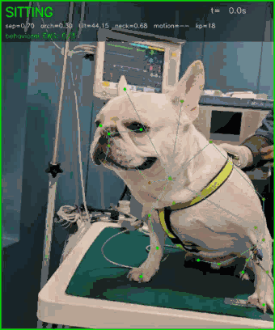
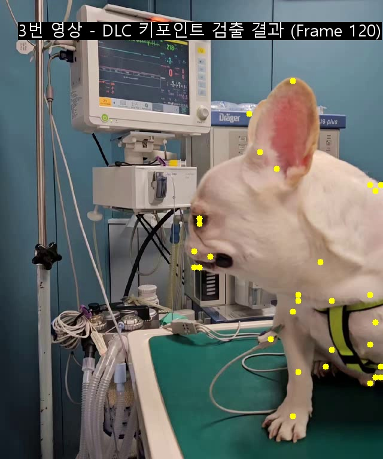
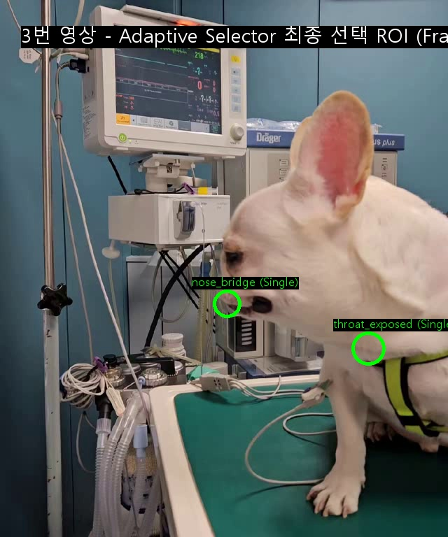
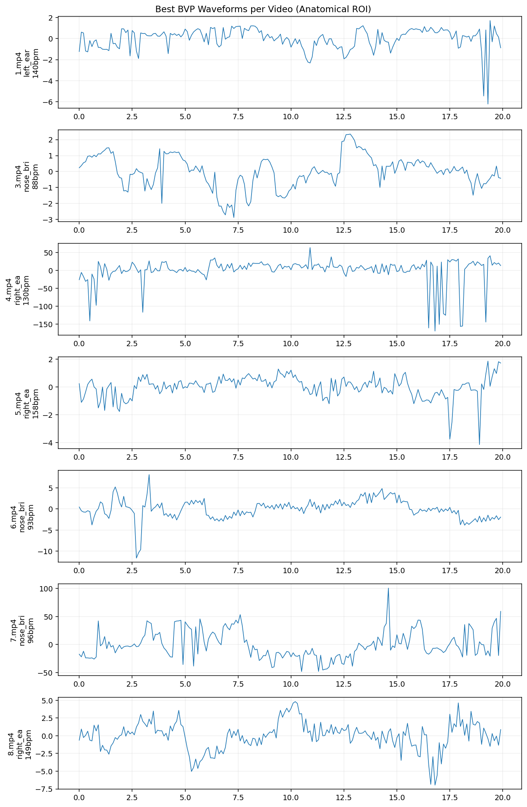
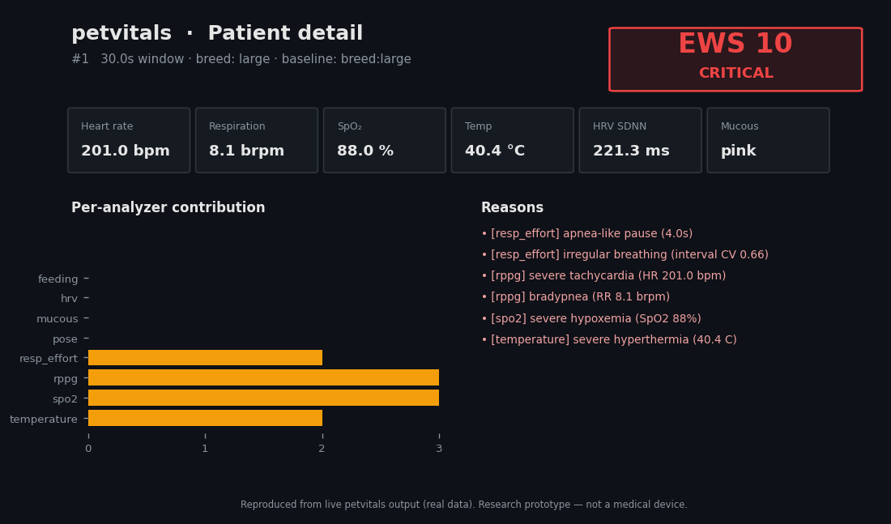
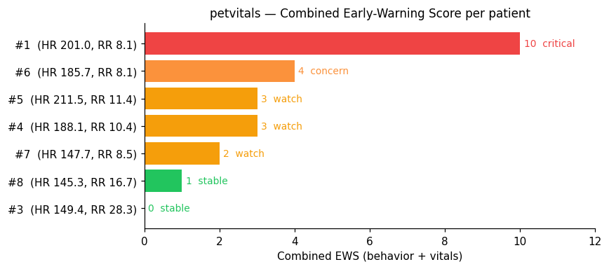

# VET-PPG · Contactless Pet Vitals & Behavior

*한국어 README: [README.ko.md](README.ko.md)*

Estimate a dog's **heart rate, respiration and behavior from plain video** — no
sensors on the body — and fuse everything into a single early-warning score (EWS).

This repo has two parts:
1. **rPPG pipeline** (`tools/`) — heart/breathing-rate extraction from RGB video.
2. **`petvitals` package** — a modular, plugin-based analyzer framework that turns
   shared inputs (video + DLC keypoints) into clinical signals and a combined EWS,
   shown in a Streamlit dashboard.

<p align="center">
  <br>
  <em>Live posture overlay (<code>petvitals viz</code>): DLC skeleton + classified posture + per-frame readout.</em>
</p>

---

## What & why

Like a hospital finger-clip reads pulse from skin-color changes, **rPPG** reads
them from a camera at a distance. Dogs are much harder than humans — **fur,
panting, motion, glare** — so naive face-box methods collapse to a ~100 bpm
artifact. The approach: anatomical thin-fur ROIs from SuperAnimal keypoints +
panting-subtraction/cardiac-amplification (A+B) + a data-driven per-zone ROI
selector. Details: [`docs/research/`](docs/research/).

<p align="center">
  
  
</p>
<p align="center"><em>SuperAnimal keypoints (left) → the adaptive selector picks thin-fur ROIs
(right: nose_bridge + throat) for a brachycephalic dog. Monitor reads ~218 bpm.</em></p>

> ⚠️ Research prototype — **not a medical device, not clinically validated.** All
> thresholds are configurable defaults, not clinical cutoffs.

---

## Performance (rPPG HR)

Ground truth = OCR'd monitor BPM (`dataset_front/video_labels_ocr.csv`, 7 clips).
Metric = mean absolute error (bpm, lower = better).

| Stage | 7-video MAE |
|-------|:-----------:|
| Baseline face-box | ~70–90+ |
| + Anatomical ROIs | ~55–65 |
| + A+B preprocessing | ~45–55 |
| + Multi-patch | ~40–48 |
| + Adaptive selector | ~38–42 |
| + Dog-specific weights v1 | **37.5** (best; Video 7 → 21.3) |

Full table: [`docs/research/PERFORMANCE_EVOLUTION_TABLE.md`](docs/research/PERFORMANCE_EVOLUTION_TABLE.md).
These are coarse video-level labels — prototype method-selection, not clinical validation.

<p align="center">
  
</p>
<p align="center"><em>Recovered rPPG pulse (BVP) waveforms per clip from the best anatomical ROI.</em></p>

**Preliminary agreement (honest):** an oracle selector matches the monitor HR to
**±2 bpm** (the signal *is* recoverable), but the honest leave-one-video-out selector
gives **MAE ~45 bpm** with a −38 bias that worsens on fast hearts. The signal is
present; robust automatic selection is the open, **data-limited** problem. Full
analysis: [`docs/research/PRELIMINARY_VALIDATION.md`](docs/research/PRELIMINARY_VALIDATION.md).

<p align="center"></p>

---

## The `petvitals` framework

One shared `Session` → many independent **analyzers** → fused **EWS**. Adding a
capability is one file + one import. Current analyzers:

`pose` (posture/activity) · `rppg` (HR/RR/panting) · `hrv` (SDNN/RMSSD) ·
`feeding` (oral activity) · `spo2` · `temperature` · `resp_effort` (pattern/apnea) ·
`mucous` (membrane color). Ranges come from species/breed/patient baselines.

Design + "add an analyzer" guide: [`docs/en/architecture.md`](docs/en/architecture.md).

<p align="center">
  
</p>
<p align="center">
  
</p>
<p align="center"><em>Dashboard patient-detail view and the per-patient EWS overview
(behavior + vitals), reproduced from real analyzer output.</em></p>

---

## Quick start

### rPPG pipeline (Python)
```bash
python -m venv .venv && source .venv/Scripts/activate   # Win: .venv\Scripts\activate
pip install -r requirements.txt
python tools/analyze_video.py --stem 3 --dog_aware --relax_rejection
```

### petvitals analyzers + EWS
```bash
python -m petvitals list                 # list analyzers
python -m petvitals run  --stem 1        # all analyzers + fused EWS
python -m petvitals viz  --stem 3        # posture overlay video/frames
```

### Dashboard (Streamlit)
```bash
pip install -r requirements.txt          # includes streamlit
python tools/export_ews_ui.py            # compute EWS for all clips
streamlit run dashboard/app.py           # open the dashboard
```

---

## Repository layout

```
petvitals/        modular analysis package (core / analyzers / ews / viz / cli)
tools/            rPPG pipeline + research scripts (50) + exporters
dashboard/        Streamlit dashboard (app.py) — primary UI
ui/               legacy React/AI-Studio HUD (optional; superseded by dashboard/)
docs/
  en/  ko/        maintained docs, split by language (architecture, clinical, pose)
  research/       legacy rPPG design docs + per-stage pipeline + perf table
reports/          evaluation outputs, patient profiles, sensor inputs
dataset_front/    front-view clips + OCR labels   dataset_multi/  multi-view clips
DogFaceModel_Deploy/   dog-face YOLO model + demo
archive/          superseded experiments & old report docs
```

> **Not in git** (size; see `.gitignore`): virtualenvs, caches, `node_modules`,
> raw `*.mp4`, model weights. Get datasets/weights separately.

---

## Documentation

| Topic | EN | KO |
|-------|----|----|
| Architecture & extending | [en](docs/en/architecture.md) | [ko](docs/ko/architecture.md) |
| Clinical requirements | [en](docs/en/clinical-requirements.md) | [ko](docs/ko/clinical-requirements.md) |
| Pose classifier | [en](docs/en/pose-classifier.md) | [ko](docs/ko/pose-classifier.md) |
| rPPG research / pipeline | [`docs/research/`](docs/research/) | (KR guide included) |

---

## License

MIT (see [`LICENSE`](LICENSE)). Third-party components keep their own terms:
**Ultralytics YOLO = AGPL-3.0**, DeepLabCut / SuperAnimal have their own licenses —
review before commercial or redistributed use.
