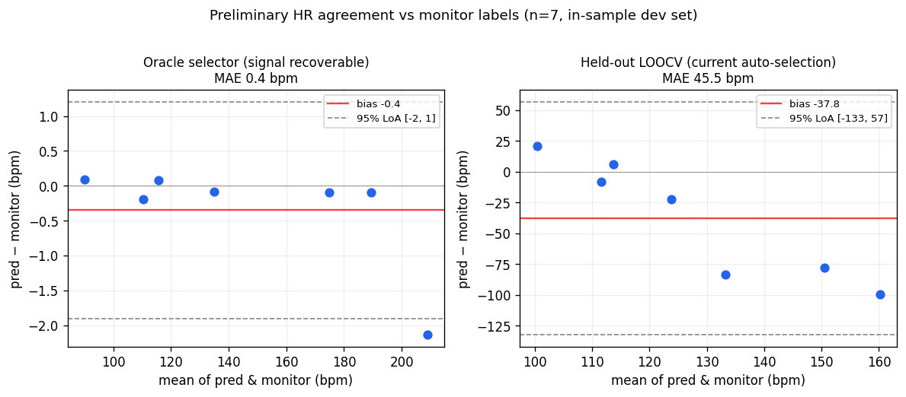

# Preliminary HR Validation (and why we need data)

*요약(KO): 영상에서 심박 신호는 **복원 가능**합니다 — 정답을 아는 oracle 선택기는 모니터 대비
MAE 0.4 bpm(95% 일치한계 ±2)로, 올바른 심박 후보가 거의 항상 존재함을 보입니다. 그러나 라벨을
보지 않는 정직한 교차검증(LOOCV)은 MAE 45 bpm, 편향 −38(고심박을 과소추정)입니다. 즉 **신호는
있으나 자동 선택이 미해결**이며, 그 격차를 좁히려면 **동기화된 ECG 기준의 데이터**가 필요합니다.*

## 1. Purpose

This is an honest preliminary look at heart-rate agreement using the only reference
we currently have — the **OCR'd vital-monitor BPM** for 7 clips
(`dataset_front/video_labels_ocr.csv`). It is **not** a clinical validation. Its job
is to (a) quantify what works, (b) locate where it breaks, and (c) make the case for
collecting synchronized reference data.

## 2. Method

- **Reference**: video-level monitor BPM (coarse, OCR-reviewed), n = 7 usable clips.
- **Estimators** (from `reports/rppg_single_view_sqi/selector_predictions.csv`):
  - **Oracle** (`oracle_window_peak`) — *label-leaked upper bound*: picks the candidate
    closest to truth. Measures whether the correct HR is **recoverable** at all.
  - **Held-out** (`supervised_peak_ranker_loocv`) — **leave-one-video-out CV**: the
    honest generalization estimate for automatic selection.
  - (Not reported as performance: `trained_*_current`, MAE ≈ 2.5 bpm, is **overfit** —
    trained and tested on the same 7 clips. Cited only as a caution.)
- **Agreement**: mean absolute error (MAE), RMSE, Bland–Altman bias and 95% limits of
  agreement (LoA = bias ± 1.96·SD), within-monitor-range %. Stratified by breed class
  (`reports/patient_profiles/`).

## 3. Headline result

| Estimator | MAE (bpm) | RMSE | Bias | 95% LoA | within-range |
|-----------|:---------:|:----:|:----:|:-------:|:------------:|
| **Oracle** (signal recoverable) | **0.4** | 0.8 | −0.4 | [−1.9, +1.2] | 86% |
| **Held-out LOOCV** (auto-selection) | **45.5** | 58.6 | −37.8 | [−133, +57] | 0% |

**Reading it**: when the correct candidate is chosen, the rPPG HR matches the monitor
to within ±2 bpm — the cardiac signal is genuinely present in the video. The honest,
held-out automatic selector instead **systematically underestimates** (bias −38) and
its error grows with true HR (right panel): it collapses toward the well-known
~100 bpm artifact and misses fast hearts.

## 4. Where it breaks (stratified, LOOCV)

| Breed class | n | MAE (bpm) |
|-------------|:-:|:---------:|
| default (lower-HR) | 3 | 16.5 |
| brachycephalic | 2 | 53.8 |
| toy | 1 | 77.9 |
| large | 1 | 83.6 |

Failure concentrates on **high-HR clips** (toy/large/some brachycephalic), exactly the
clinically important fast-heart regime.

## 5. Limitations

- **n = 7**, single site, **monitor labels (not synchronized ECG/PPG)**, video-level only.
- All 7 clips were used during development → even LOOCV is optimistic vs a truly external set.
- Single front view; dogs under anesthesia/recovery; brachycephalic-heavy sample.
- Therefore: **no clinical claims**. These are feasibility/triage numbers.

## 6. The ask — what would close the gap

The oracle-vs-LOOCV gap (0.4 → 45 bpm) is a **data problem, not a signal problem**.
To turn recoverable signal into a reliable automatic estimate we need:

1. **Synchronized reference**: simultaneous ECG (gold standard) ± pulse oximeter,
   time-aligned to video (LED/clap marker or hardware timestamp).
2. **Scale & diversity**: ≥ 30–50 animals across the **high-HR regime**, multiple
   breeds/coat colors/sizes, including awake (non-anesthetized) states.
3. **Per-condition labels** so agreement can be reported by HR band, breed, motion,
   and coat — the strata where this analysis shows failure.

With that, the supervised selector can be trained/validated out-of-sample, and the
same Bland–Altman protocol re-run against ECG for a real validation. See
[`VALIDATION_PROTOCOL.md`](VALIDATION_PROTOCOL.md) *(to be added)* for the collection plan.

---
*Reproduce: `reports/rppg_single_view_sqi/selector_predictions.csv` + the script in the
commit that added this file. Figure: `docs/img/bland_altman.png`.*
